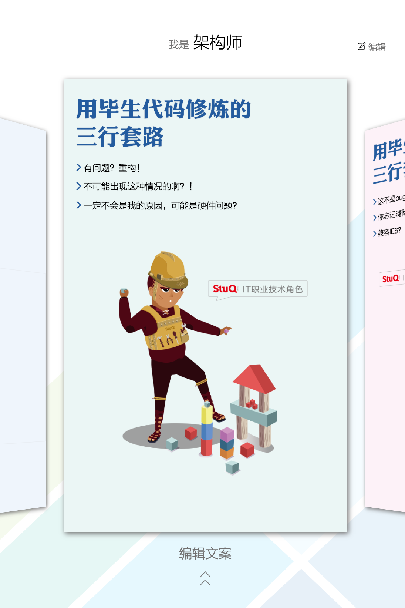
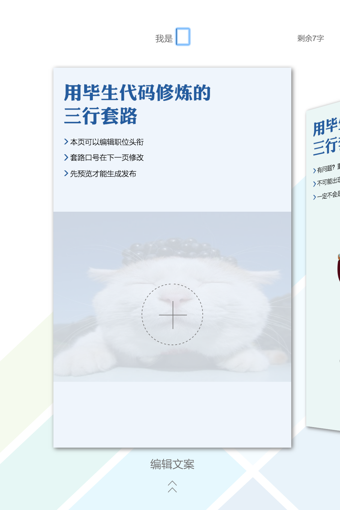
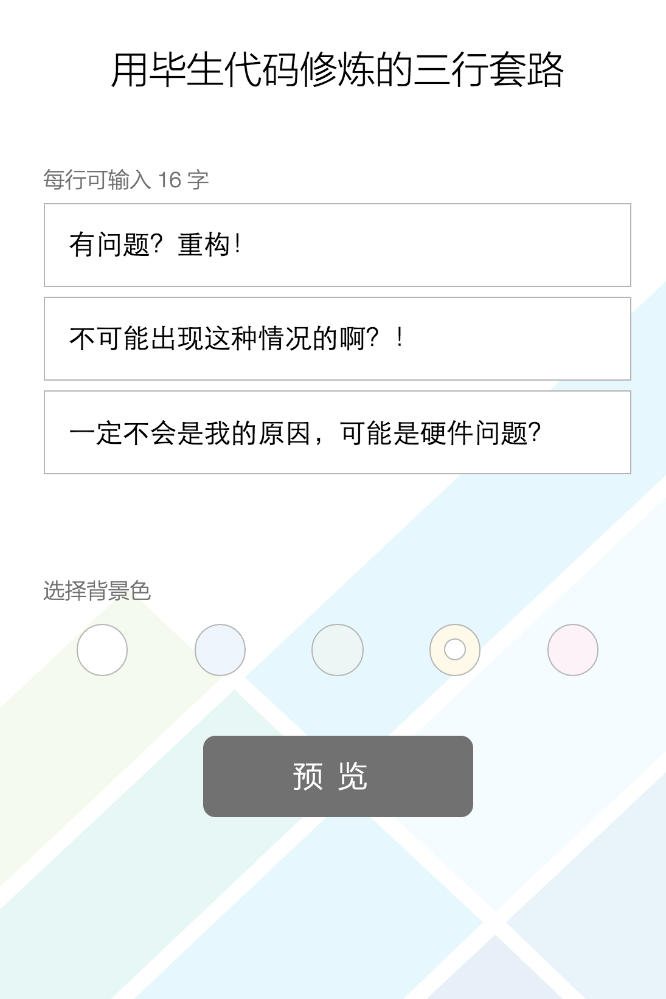
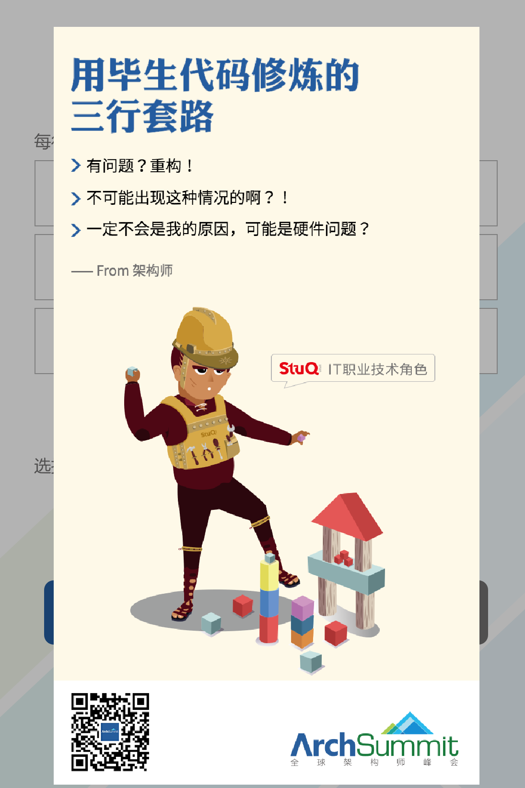

# 海报生成器

使用 &lt;canvas&gt; 的**[海报生成器](http://www.geekbang.org/poster)**。

*注：页面主要为手机端设计，在电脑浏览器中打开时，请缩小浏览器宽高比至手机竖屏比例。*

## 构建

React + ES6 + SCSS + Webpack

## 截图

## 其他

在本项目中使用的开源项目：

* [fullpage.js](https://github.com/alvarotrigo/fullPage.js/)

* [swiper](https://github.com/nolimits4web/swiper/)

* [CSS 动画](https://codepen.io/ispal/pen/mVaaJe)